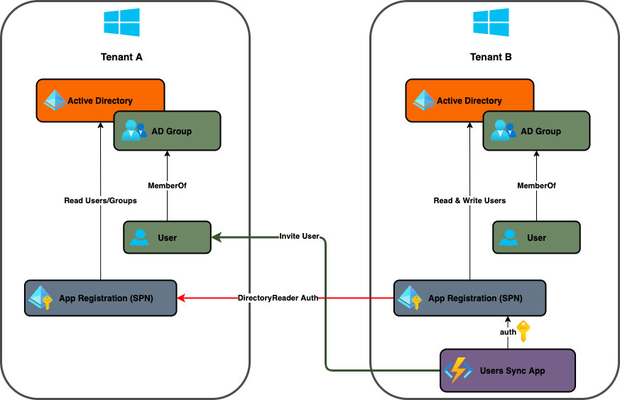

<div id="top"></div>

<!-- TITLE -->
# Azure Multi-Tenant User Synchronization
Azure Function App that synchronizes AD users between two tenants.

<!-- TABLE OF CONTENTS -->
<details>
  <summary>Table of Contents</summary>
  <ol>
    <li>
      <a href="#about-the-project">About The Project</a>
      <ul>
        <li><a href="#built-with">Built With</a></li>
      </ul>
    </li>
    <li>
      <a href="#getting-started">Getting Started</a>
      <ul>
        <li><a href="#prerequisites">Prerequisites</a></li>
        <ul>
          <li><a href="#runninglocally">Running Locally</a></li>
          <li><a href="#runningonazure">Running on Azure</a></li>
        </ul>
      </ul>
    </li>
    <li><a href="#contributing">Contributing</a></li>
    <li><a href="#license">License</a></li>
  </ol>
</details>

<!-- ABOUT THE PROJECT -->
## About The Project



The repository contains an Azure Serveless Function that synchronizes AD users between two tenants.

Motivation:
* The need to sync users between two tenants.
* Currently, an open source solution that solves the multi-tenant user synchronization problem is inexistent.
* It's a prerequesite to implement an Azure Entreprise-Scale Landing Zone.

<p align="right">(<a href="#top">back to top</a>)</p>

### Built With

The main frameworks used to develop the synchronization app are described below:

* [Azure Serveless Functions](https://azure.microsoft.com/en-us/services/functions/)
* [dotnet core 3.1](https://dotnet.microsoft.com/)

<p align="right">(<a href="#top">back to top</a>)</p>

<!-- GETTING STARTED -->
## Getting Started

Below you will find the installation process for running the function locally or on an Azure tenant.

### Prerequisites

#### Running Locally

1. Install the [Azure Functions Core Tools](https://docs.microsoft.com/en-us/azure/azure-functions/functions-run-local?tabs=v3%2Clinux%2Ccsharp%2Cportal%2Cbash%2Ckeda#v2)

2. Configure an [Azure Storage Account Emulator](https://docs.microsoft.com/en-us/azure/storage/common/storage-use-azurite?tabs=visual-studio)

3. Configure the local.settings.json file on the root folder
    ```json
    {
      "IsEncrypted": false,
      "Values": {
        "AzureWebJobsStorage": "<LOCAL_STORAGE_CONNECTION_STRING>",
        "ScheduleTrigger": "0 */5 * * * *",
        "FUNCTIONS_WORKER_RUNTIME": "dotnet",
        "SRC_TENANT_ID": "<THE_SOURCE_TENANT_ID>",
        "SRC_GROUP_ID": "<THE_SOURCE_GROUP_ID>",
        "DST_TENANT_ID": "<THE_DESTINATION_TENANT_ID>",
        "DST_GROUP_ID": "<THE_DESTINATION_GROUP_ID>",
        "CLIENT_ID": "<THE_APP_REGISTRATION_ID>",
        "CLIENT_SECRET": "<THE_APP_REGISTRATION_SECRET>",
        "REQUEST_MAX_RETRIES": "5",
        "INVITE_BASE_URL": "https://portal.azure.com"
      }
    }
    ```

4. Start the function
   ```bash
   func start
   ```

#### Running on Azure

1. Install the [Azure CLI](https://docs.microsoft.com/en-us/cli/azure/install-azure-cli)

2. Install the [Terraform CLI](https://learn.hashicorp.com/tutorials/terraform/install-cli)

3. Login to your Azure Tenant
   ```bash
   az login --tenant <YOUR_AZURE_TENANT>
   ```

4. Create a [Service Principal](https://registry.terraform.io/providers/hashicorp/azurerm/latest/docs/guides/service_principal_client_secret) for Terraform automation with the correct permissions to interact with Azure Resources.

5. If you want, create an alias to export the environment variables for your Service Principal
   ```bash
   alias export-terraform-for-azurerm="export ARM_CLIENT_ID=<YOUR_SPN_ID> && export ARM_CLIENT_SECRET=<YOUR_SPN_SECRET> && export ARM_SUBSCRIPTION_ID=<YOUR_SUBSCRIPTION_ID> && export ARM_TENANT_ID=<YOUR_TENANT_ID>"
   ```

6. Deploy the Azure Resources using Terraform
   ```bash
   cd terraform/
   terraform init
   terraforn plan -out plan.tfplan
   terraform apply plan.tfplan
   ```

7. Create an [Azure App Registration](https://docs.microsoft.com/en-us/azure/active-directory/develop/howto-create-service-principal-portal) and store the client secret on the key vault created via terraform. NOTE: the app registration needs the correct permissions on both tenants to be able to read/write groups and send invitations.

8. Add the necessary ```app_settings``` in the ```terraform/func.tf``` file

9. Deploy the function using the ```Azure Functions Core Tools``` or by creating a new tag on the main branch (the code will be deployed using Github Actions)
   ```bash
   az account set --subscription <YOUR_DESTINATION_SUBSCRIPTION_ID>
   func azure functionapp publish users-sync
   ```
   or
   ```bash
   git tag vx.x.x
   git push --tags
   ```
  NOTE: for the Github Actions to work you need to get the [Azure Function Publish Profile](https://docs.microsoft.com/en-us/azure/azure-functions/functions-how-to-github-actions?tabs=dotnet) and store it as a github secret with the name ```AZURE_FUNCTIONAPP_PUBLISH_PROFILE```.

<p align="right">(<a href="#top">back to top</a>)</p>

<!-- CONTRIBUTING -->
## Contributing

Contributions are what make the open source community awesome! Any contributions you make are **greatly appreciated**.

1. Fork the Project

2. Create your Feature Branch
   ```bash
   git checkout -b feature/my-feature
   ```

3. Commit your Changes
   ```bash
   git commit -m 'Add some feature'
   ```

4. Push to the Branch
   ```bash
   git push origin feature/my-feature
   ```

5. Open a Pull Request

<p align="right">(<a href="#top">back to top</a>)</p>

<!-- LICENSE -->
## License

Distributed under the MIT License. See `LICENSE` for more information.

<p align="right">(<a href="#top">back to top</a>)</p>